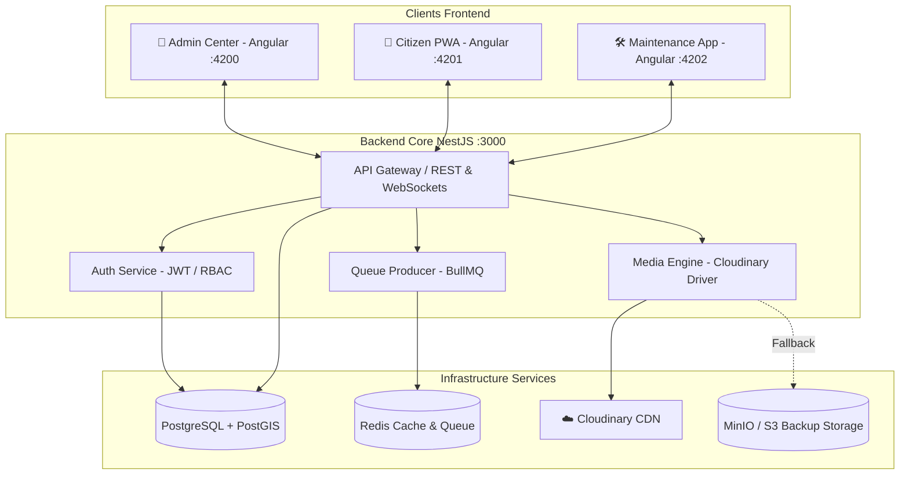

<div align="center">

# ⚡ STEGFlow

### **Plateforme Numérique Intelligente de Gestion Électrique & d'Interventions Terrain**
*Conçue pour la Société Tunisienne de l'Électricité et du Gaz (STEG)*

[](https://angular.dev/)
[](https://nestjs.com/)
[](https://postgis.net/)
[](https://redis.io/)
[](https://cloudinary.com/)
[](https://www.docker.com/)

[Vue d'ensemble](#-vue-densemble) • [Applications & Portails](#-applications--portails) • [Architecture Système](#-architecture-syst%C3%A8me) • [Installation](#-installation-rapide) • [Comptes Demo](#-comptes-de-d%C3%A9monstration) • [Documentation API](#-documentation--api)

---

</div>

## 📖 Vue d'ensemble

**STEGFlow** est une solution logicielle d'entreprise centralisée permettant d'optimiser le réseau électrique national, d'automatiser le suivi des pannes, de coordonner les équipes de maintenance sur le terrain en temps réel et de fournir un portal d'information transparent pour les citoyens.

### 🌟 Fonctionnalités Clés
- 🗺️ **Cartographie Géospatiale PostGIS & MapLibre** : Visualisation dynamique des réseaux basse/moyenne tension et routage précis des équipes d'intervention.
- 📸 **Gestion Médias Cloudinary CDN** : Upload instantané et sécurisé des preuves photo terrain avec conversion dynamique et diffusion optimisée.
- 📡 **Suivi Temps Réel & WebSockets** : Retransmission en direct de la position GPS des équipes et synchronisation bidirectionnelle du statut des interventions.
- 🔔 **Alertes & Communications Automatisées** : Moteur de notification asynchrone propulsé par **BullMQ & Redis** (SMS, Push PWA, E-mail).
- 🛡️ **Confidentialité & Obfuscation GPS** : Floutage géographique dynamique des positions techniciens côté citoyen pour garantir la sécurité terrain tout en maintenant un temps d'arrivée estimé (ETA) exact.

---

## 💻 Applications & Portails

STEGFlow se compose de 4 modules interconnectés au sein d'un monorepo ultra-performant :

| Module | Rôle & Public Cible | Commande | URL Locale |
| :--- | :--- | :---: | :---: |
| 🏬 **Centre STEG (Admin)** | Dashboard de supervision globale, gestion du réseau, dispatching d'équipes et planification des coupures. | `npm run start:admin` | [`http://localhost:4200`](http://localhost:4200) |
| 📱 **Portail Citoyen (PWA)** | PWA citoyenne pour la déclaration d'incidents avec photo, suivi live des interventions et état du réseau domestique. | `npm run start:citizen` | [`http://localhost:4201`](http://localhost:4201) |
| 🛠️ **Équipe Maintenance** | Application mobile-first pour les techniciens sur le terrain (dossier d'intervention, navigation GPS, preuves Cloudinary, bouton SOS). | `npm run start:maintenance` | [`http://localhost:4202`](http://localhost:4202) |
| ⚙️ **API Core (NestJS)** | API RESTful & WebSockets Gateway, orchestration PostgreSQL/PostGIS, files d'attente BullMQ et Media Engine. | `npm run start:api` | [`http://localhost:3000/api/v1`](http://localhost:3000/api/v1) |

---

## 🏗️ Architecture Système



---

## 🚀 Installation Rapide

### Prérequis
- **Node.js** `>= 20.x`
- **npm** `>= 10.x`
- **Docker Desktop** (recommandé pour la stack complète)

### 1. Cloner le projet
```bash
git clone https://github.com/RayenMestiri/STEGFlow.git
cd STEGFlow
```

### 2. Installer les dépendances
```bash
npm install
npm --prefix apps/api install
```

### 3. Configurer l'environnement
Copiez les fichiers de configuration `.env.example` :
```bash
cp .env.example .env
cp .env.example apps/api/.env
```

> [!TIP]
> Pour activer l'upload d'images direct sur Cloudinary, renseignez vos identifiants Cloudinary dans `.env` :
> ```env
> STORAGE_PROVIDER=cloudinary
> CLOUDINARY_CLOUD_NAME=roarxt0j
> CLOUDINARY_API_KEY=879564454732789
> CLOUDINARY_API_SECRET=5aCnzAoGCTPGoPQAMY6sEr65k8Y
> ```

---

## 🐳 Démarrage avec Docker Compose

Lancez l'ensemble des conteneurs (Base de données PostGIS, Redis, MinIO et les 4 applications) en une seule commande :

```bash
docker compose up --build -d
```

Une fois démarré, accédez directement aux interfaces :
- **Supervision Admin** : `http://localhost:4200`
- **Portail Citoyen** : `http://localhost:4201`
- **Application Technicien** : `http://localhost:4202`
- **Swagger Documentation** : `http://localhost:3000/api/docs`

---

## 🔑 Comptes de Démonstration

| Espace | E-mail | Mot de passe | Rôle RBAC |
| :--- | :--- | :--- | :--- |
| 🛡️ **Supervision STEG** | `superviseur@steg.tn` | `Admin2026!` | `admin`, `supervisor` |
| 🛠️ **Équipe Terrain** | `technicien@steg.tn` | `Tech2026!` | `technician` |
| 👤 **Citoyen** | `citoyen@steg.tn` | `Client2026!` | `citizen` |

*Le bouton « Connexion Demo » présent sur chaque interface remplit automatiquement ces accès.*

---

## 📸 Intégration Cloudinary Media Engine

STEGFlow intègre un moteur multimédia hybride :
- 🚀 **Cloudinary CDN** : Envoi immédiat des preuves d'incidents (compteurs endommagés, câbles à terre) avec transformation automatique (format WebP/AVIF, compression intelligente).
- 📦 **MinIO / S3 Fallback** : Basculement transparent en stockage local/S3 si la connexion externe est interrompue.

---

## 🧪 Tests & Validation

Exécutez la suite de tests unitaires et de compilation :

```bash
# Valider les builds de toutes les applications Angular & NestJS
npm run build:all

# Exécuter les tests unitaires frontend
npm test

# Exécuter les tests unitaires API
npm run test:api
```

---

## 📄 Licence & Crédits

Projet développé pour la **Société Tunisienne de l'Électricité et du Gaz (STEG)**.  
Détails d'architecture disponibles dans [`docs/ARCHITECTURE.md`](docs/ARCHITECTURE.md).
