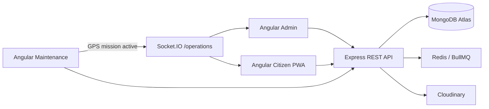
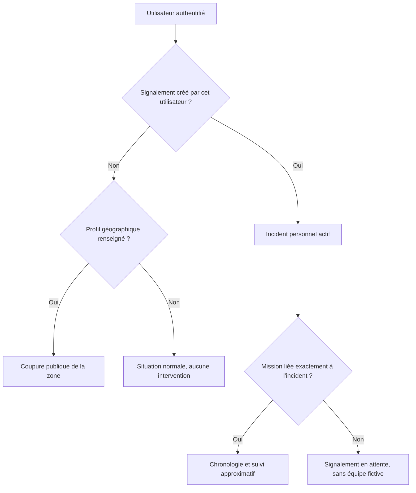

# Architecture STEGFlow — MEAN

## Vue générale

Le backend réside dans `backend/`. Les applications Angular ne contiennent
aucun secret et consomment toutes le même préfixe `/api/v1`.

## Collections MongoDB

- `users`
- `auth_events`
- `outages`
- `incidents`
- `missions`
- `field_teams`
- `notification_campaigns`
- `audit_logs`
- `system_settings`
- `citizen_confirmations`

Les incidents, missions et équipes utilisent des points GeoJSON
`{ type: "Point", coordinates: [longitude, latitude] }` avec index `2dsphere`.

## Liaison des données citoyennes

Une mission globale n’est jamais exposée à tous les citoyens.

## Sécurité

- JWT d’accès de courte durée.
- Refresh token HttpOnly, rotation à chaque renouvellement.
- Rôles `admin`, `supervisor`, `dispatcher`, `technician`, `citizen`.
- Verrouillage temporaire après cinq échecs de connexion.
- Limitation de débit sur login et inscription.
- Validation Zod côté serveur.
- Photos validées et stockées uniquement depuis Express.
- Secrets chargés depuis `backend/.env`.
- Position citoyenne arrondie ; position exacte réservée au pilotage.

## Notifications

L’API crée une campagne MongoDB puis publie un job BullMQ. Le worker met à jour
les états `queued → sending → delivered/failed`. Les adaptateurs réels FCM, SMS
et SMTP se branchent dans `notifications.service.ts`.

## Déploiement

Docker Compose démarre Redis, Express et les trois bundles Angular. MongoDB Atlas
et Cloudinary restent des services managés externes. Le dépôt ne contient qu’une
implémentation backend : Express/Mongoose dans `backend/`.
