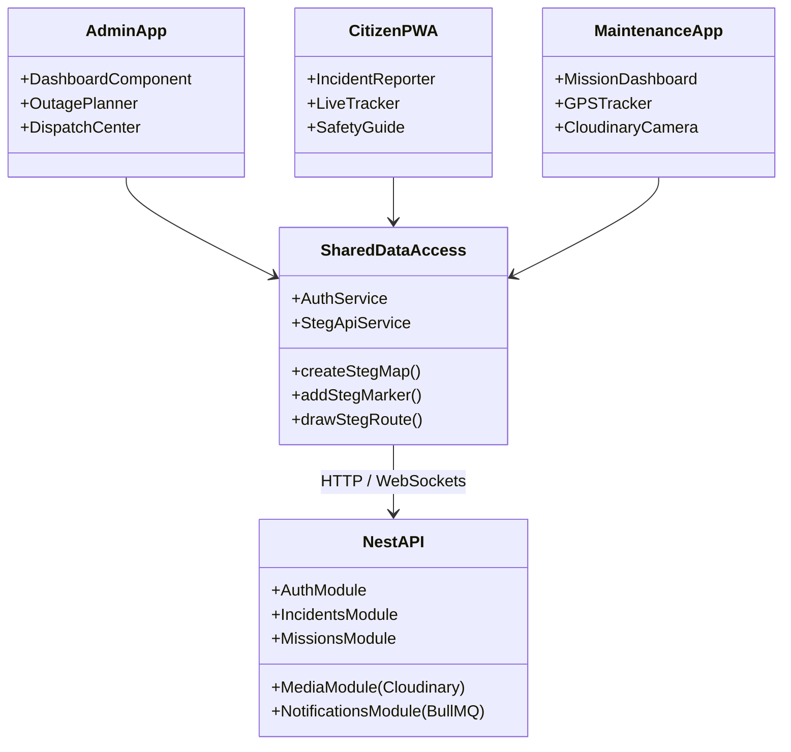
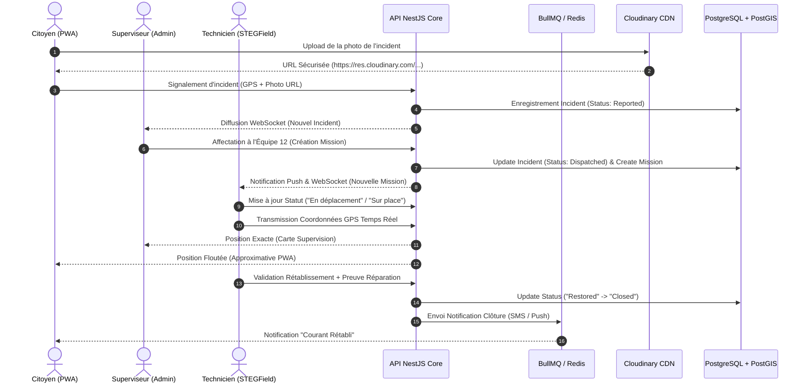
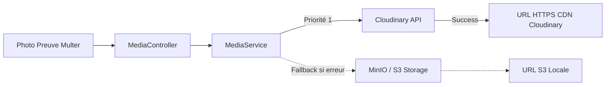

# 📐 Architecture Technique STEGFlow

Ce document détaille les principes d'architecture logicielle, la modélisation des données géospatiales, le flux d'événements et la stratégie de sécurité de la plateforme **STEGFlow**.

---

## 🏛️ Vue d'Ensemble des Composants

La plateforme adopte une architecture modulaire en **Monorepo Angular + NestJS**, favorisant le partage de types TypeScript, de modèles DTO et de composants cartographiques.

---

## 🔄 Flux d'une Intervention Terrain (Sequence Diagram)

---

## 🗺️ Gestion des Données Géospatiales (PostGIS)

L'API exploite les capacités spatiales de **PostGIS** pour gérer la topologie du réseau électrique :

- **`Point` (Geometry SRID 4326)** : 
  - Emplacement des incidents déclarés par les citoyens.
  - Position du matériel (compteurs, transformateurs).
  - Position GPS instantanée transmise par le smartphone des techniciens.
- **`LineString`** :
  - Lignes électriques aériennes et souterraines (départs Moyenne Tension).
  - Tracé d'itinéraire de la mission de maintenance.
- **`Polygon`** :
  - Zones d'alimentation électrique et périmètres impactés par les coupures programmées.
  - Calcul automatique d'intersection spatiale (`ST_Intersects`) pour déterminer les abonnés concernés.

### 🛡️ Obfuscation des Coordonnées GPS pour les Citoyens
Pour des raisons de sécurité du personnel de maintenance, la position GPS transmise sur le portail citoyen fait l'objet d'un traitement géométrique :
1. Arrondi des coordonnées à 2 décimales.
2. Injection d'un bruit aléatoire dans un rayon de 300 mètres.
3. Restriction de l'affichage à la durée exacte de la mission.

---

## 📸 Pipeline Multimédia Hybride (Cloudinary + S3)

1. **Formatage automatique** : Conversion transparente vers les formats modernes (AVIF/WebP) et dimensionnement dynamique selon l'écran du client.
2. **Métadonnées** : Suppression des données EXIF sensibles (GPS interne de la photo) avant publication.
3. **Résilience** : En cas d'indisponibilité du réseau externe, le système bascule sur le bucket S3 local MinIO.

---

## 🔐 Modèle de Sécurité & RBAC

L'accès à l'API est protégé par une double couche d'authentification et d'autorisation :

1. **JSON Web Token (JWT)** :
   - Access Token à durée courte (15 minutes).
   - Refresh Token sécurisé stocké dans un cookie `HttpOnly` et `SameSite=Strict`.
2. **Matrice des Rôles (RBAC)** :
   - `admin` / `supervisor` : Accès complet à la supervision, création de coupures, affectation et audit.
   - `dispatcher` : Gestion des équipes terrain et des urgences.
   - `technician` : Accès restreint aux missions attribuées à son équipe.
   - `citizen` : Déclaration et suivi limité à son contrat et sa zone géographique.

---

## ⚡ Système de Files d'Attente (BullMQ & Redis)

Les opérations lourdes sont déportées de l'Event Loop Node.js vers des workers asynchrones :
- **Notification Queue** : Distribution massive des SMS et Push lors de l'activation d'une coupure programmée.
- **Retry Strategy** : Reprise exponentielle avec backoff en cas d'échec de distribution.
- **Dead Letter Queue (DLQ)** : Isolation des messages non délivrables pour analyse par les administrateurs.
