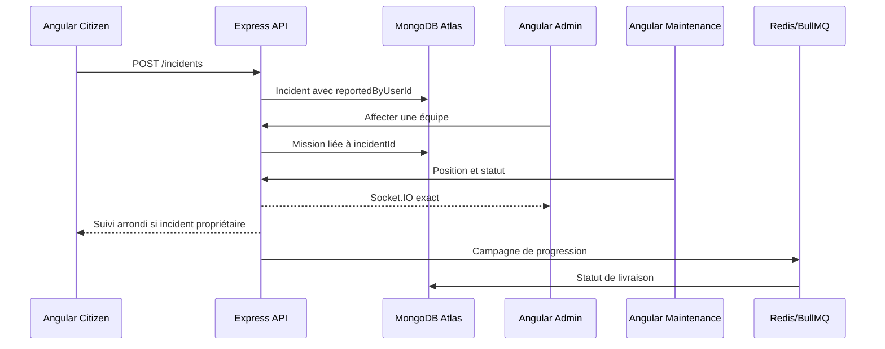

# Fonctionnement de STEGFlow

## 1. Citoyen

- crée un compte sécurisé ;
- consulte uniquement sa situation réelle ;
- voit les coupures publiques sur la carte ;
- crée un signalement géolocalisé avec photos Cloudinary ;
- suit une équipe seulement si une mission est liée à son propre signalement ;
- reçoit une position d’équipe arrondie ;
- confirme une coupure ou le rétablissement ;
- consulte les consignes de sécurité.

Un compte neuf sans adresse, contrat ou signalement affiche :

```text
Réseau normal
0 signalement
0 client concerné
Aucune intervention active
```

## 2. Centre des opérations

- planifie et publie les coupures ;
- vérifie et priorise les signalements ;
- affecte une équipe disponible ;
- voit les positions GPS exactes des équipes actives ;
- supervise les missions et urgences ;
- envoie ou relance les campagnes ;
- consulte le journal d’audit ;
- modifie les paramètres opérationnels.

## 3. Équipe terrain

```text
Affectée → Acceptée → En route → Sur place → Diagnostic
→ Réparation → Tests → Rétabli → Clôturée
```

L’équipe peut partager sa position uniquement pendant une mission, compléter le
diagnostic, demander du matériel, ajouter les preuves photo, déclencher une
alerte urgente et clôturer le rapport.

## 4. Cycle technique



## 5. Photos

Le frontend envoie un fichier multipart à `/api/v1/media/photos`. Express vérifie
le type JPEG/PNG/WebP et la limite de 8 Mo, puis envoie l’image vers Cloudinary.
Seule l’URL HTTPS retournée est enregistrée dans MongoDB.

## 6. Cartes

- MapLibre + tuiles OpenStreetMap ;
- coordonnées de coupure provenant des zones MongoDB ;
- incident depuis son point GeoJSON ;
- équipe depuis la dernière position réellement transmise ;
- aucun marqueur équipe n’est inventé lorsqu’aucun GPS n’existe.
